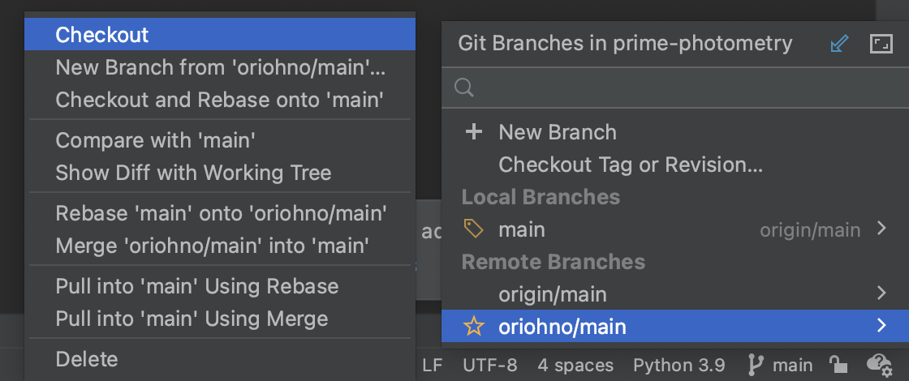
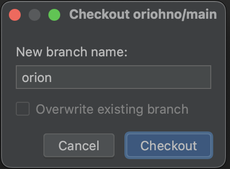
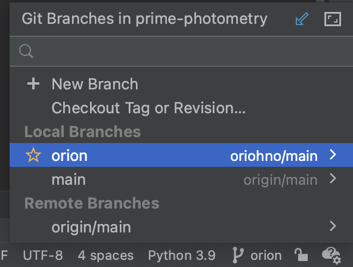
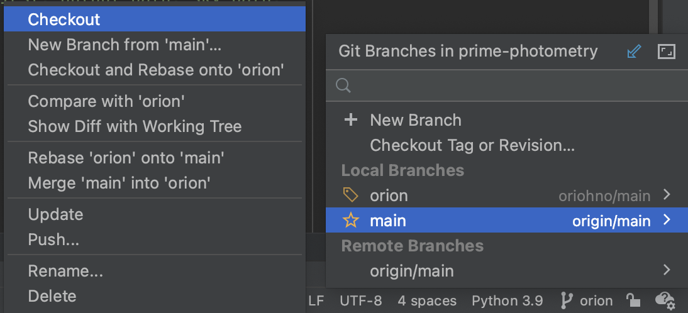
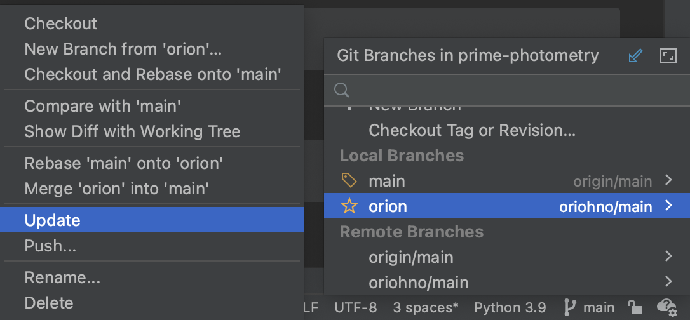
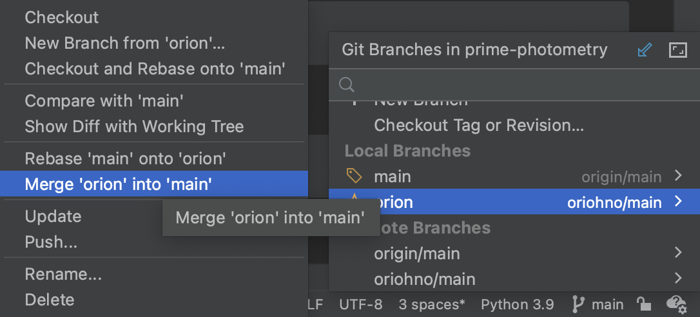

# git remote instructions

## Add remote repo

1) Open a terminal, and change directories to the git repository directory (prime-photometry for this repo)
2) List current remote repositories:

        git remote -v

    The output will show your current remote repositories:
  
        origin	git@github.com:joedurbak/prime-photometry.git (fetch)
        origin	git@github.com:joedurbak/prime-photometry.git (push) 

3) If the remote repo you want to add isn't there already, it can be added as follows:

        git remote add <remote_name> <remote_repo>

    For example:

        git remote add oriohno git@github.com:Oriohno/prime-photometry.git

4) Check that the remote repo has appeared

        git remote -v

   For this example, our output is now as follows:
  
       origin	git@github.com:joedurbak/prime-photometry.git (fetch)
       origin	git@github.com:joedurbak/prime-photometry.git (push)
       oriohno	git@github.com:Oriohno/prime-photometry.git (fetch)
       oriohno	git@github.com:Oriohno/prime-photometry.git (push)

5) Now that we've added a remote repo, we need to fetch the branches. If you check now, there won't be any remote branches

        git branch -v -a

      Output:
    
        * main                8f98404 test test test
          remotes/origin/HEAD -> origin/main
          remotes/origin/main 8f98404 test test test

      To fetch the remote branches runL
    
        git fetch --all
    
      Now, we can check the branches again:

        git branch -v -a

      Output:

        * main                 8f98404 test test test
          remotes/origin/HEAD  -> origin/main
          remotes/origin/main  8f98404 test test test
          remotes/oriohno/main 3704c7e more work on sky!

## Using the Remote Repo in PyCharm

Now that the remote repo is available along with its branches, you should be able to use the remote branches in PyCharm

1) Checkout the remote branch

   

2) Give the branch a name and click "Checkout"

   

3) You should now be able to use this remote branch as if it were a local branch

   

## Updating and merging branches

The main reason to set up a remote branch is to merge its updates into your working branch

1) If you aren't in your desired working branch already, checkout that branch

   

2) Next, update the branch you're trying to merge

   

3) Now that the branch is updated, we can merge the remote branch into the working branch

   
